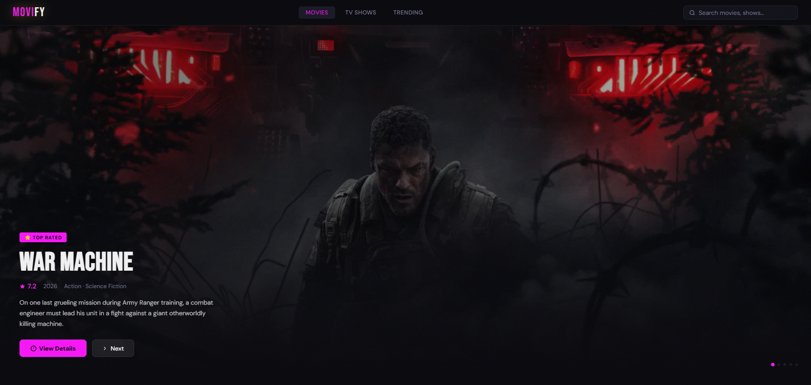
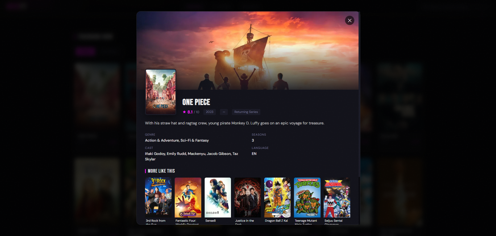
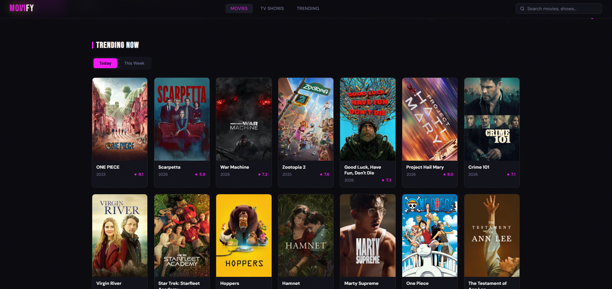
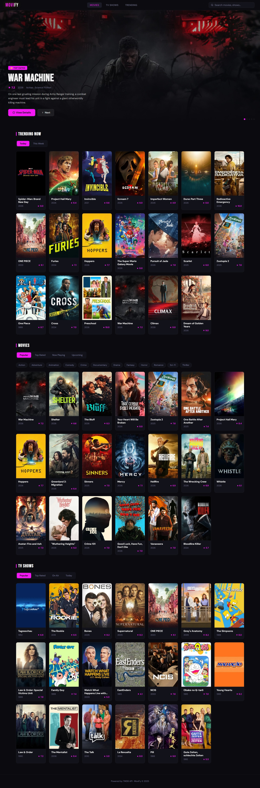

# Movify - api
  
This project demonstrates how to use the TMDB (The Movie Database) API to fetch and display movie data.

## Tech Stack

- **HTML - CSS**
- **Javascript**
- **TMDB api**

## Installation

just open index.html on browser

## Screenshot

